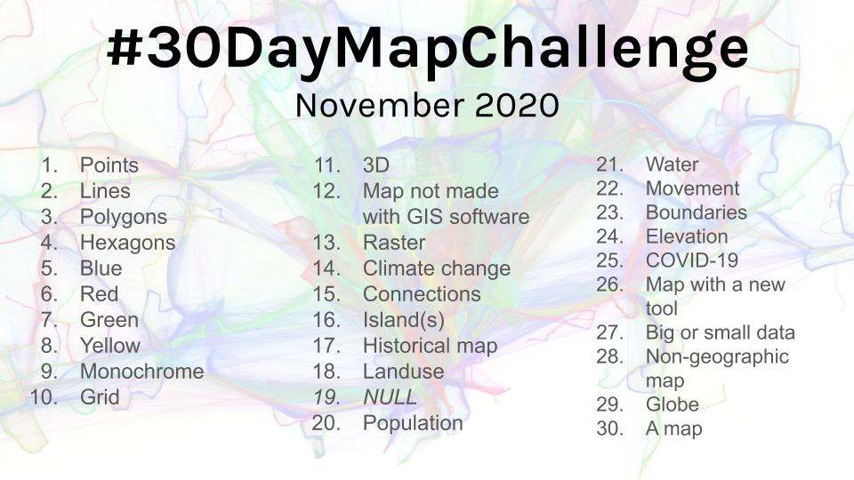

Topi Tjukanov announced the 30 Day Map Challenge for the first time in November 2019. This is the second year of the challenge.
Last year I managed to do all 30 maps and one of the aims was to do all the maps in QGIS and learn some new stuff along the way. This year I aim the same and we'll see how it goes ;)

[Link to Topi's Twitter post](https://twitter.com/tjukanov/status/1311568912950140930)
