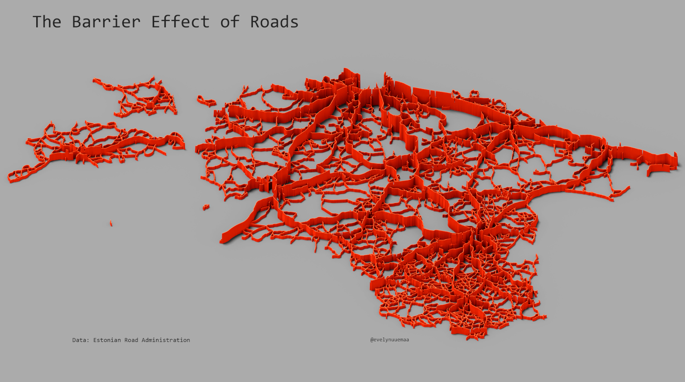

---
layout: article
title: Day 11 - 3D - Traffic density
modified: 2020-11-11
categories: mapchallenge
image:
  teaser: day11_3D_traffic_teaser.png

Estonian road traffic density mapped as 3D which visualizes them as barriers.
Used tools: QGIS and Aerialod.
Data: Estonian Transport Administration

[Link to Twitter post](https://twitter.com/evelynuuemaa/status/1326464638830202880)
