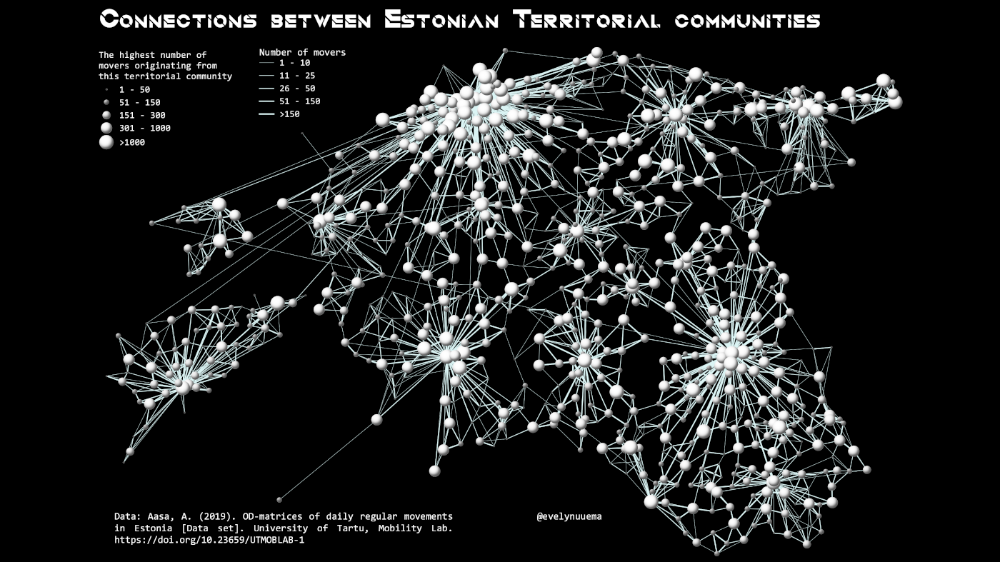

Connections between Estonian territorial communities based on the regular movements in January 2016.

Used tools: Python, QGIS
Data: Uni Tartu Mobility Lab

[Link to Twitter post](https://twitter.com/evelynuuemaa/status/1327900766200279040)
