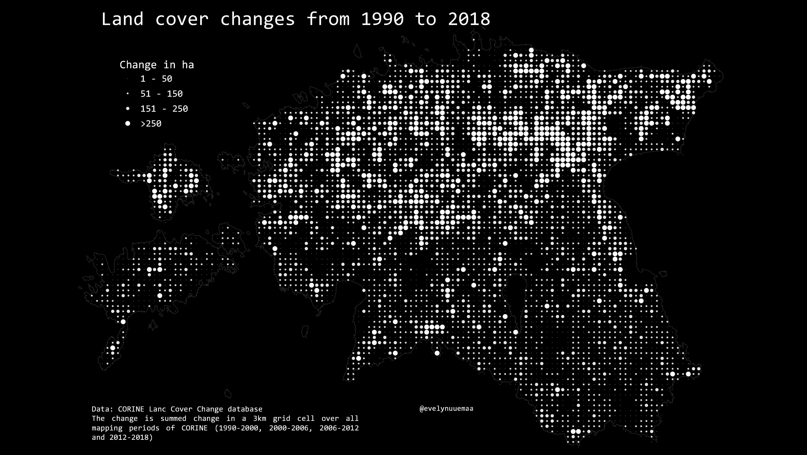

Land use and cover changes from 1990 to 2018 in Estonia summed over the years into 3km grid based on CORINE land cover change database. Quite clear difference between North Estonia and South Estonia.

Methods: The final style is achieved by using centroids of the grid and mapping them as point symbols sized according to the change magnitude. 

Used tools: QGIS
Data: Estonian Land Board

[Link to Twitter post](https://twitter.com/evelynuuemaa/status/1328971030208057345)
