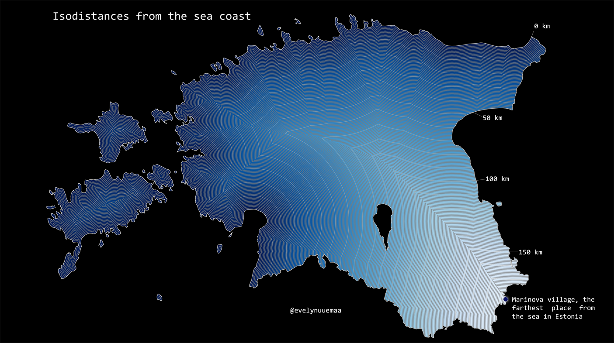

Isolines are very efficient way to map quantitative data as lines. The current map is representing 1km-isodistances from the Baltic sea. The farthest village from the sea in Estonia is Marinova village (approx 185km from the coast).

Methods: 1km buffers were generated to the coastline. 10 km zone were extracted and converted into lines to emphasize the 10km-isolines. 

Data: Estonian Land Board Generalised Estonian Topographic Database

Tools: QGIS

[Link to Twitter post](https://twitter.com/evelynuuemaa/status/1323201284875452416)
