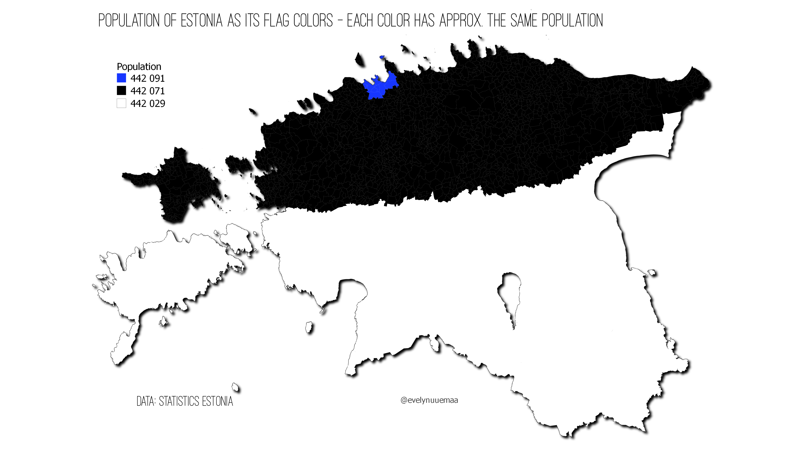

Population of Estonia mapped as its flag colors - each color has approx. the same. 

Methods: I used administrative units to identify the iso-population areas. Simple but very cool idea from [here](https://bit.ly/3nBcHAo)

Used tools: QGIS

Data: Statistics Estonia

[Link to Twitter post](https://twitter.com/evelynuuemaa/status/1329701060299157504)
