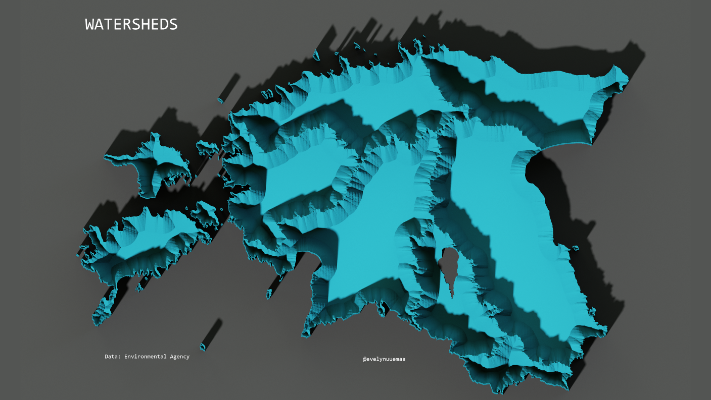

Estonian watersheds mapped as bowls. 

Methods: The watersheds were visualised first in QGIS using shapeburst fill and then exported to Aerialod.

Used tools: QGIS, Aerialod

Data: Estonian

[Link to Twitter post](https://twitter.com/evelynuuemaa/status/1330075049727041539)
