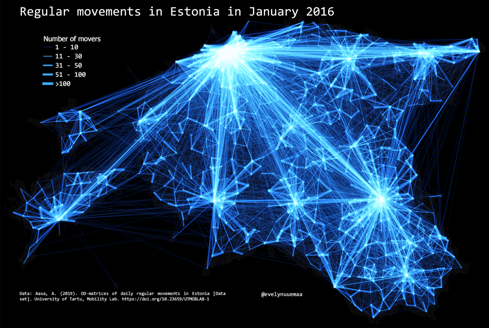

Regular movements between Estonian territorial communities in January 2016.

Used tools: QGIS

Data: Uni Tartu Mobility Lab

[Link to Twitter post](https://twitter.com/evelynuuemaa/status/1352529300050862080)
