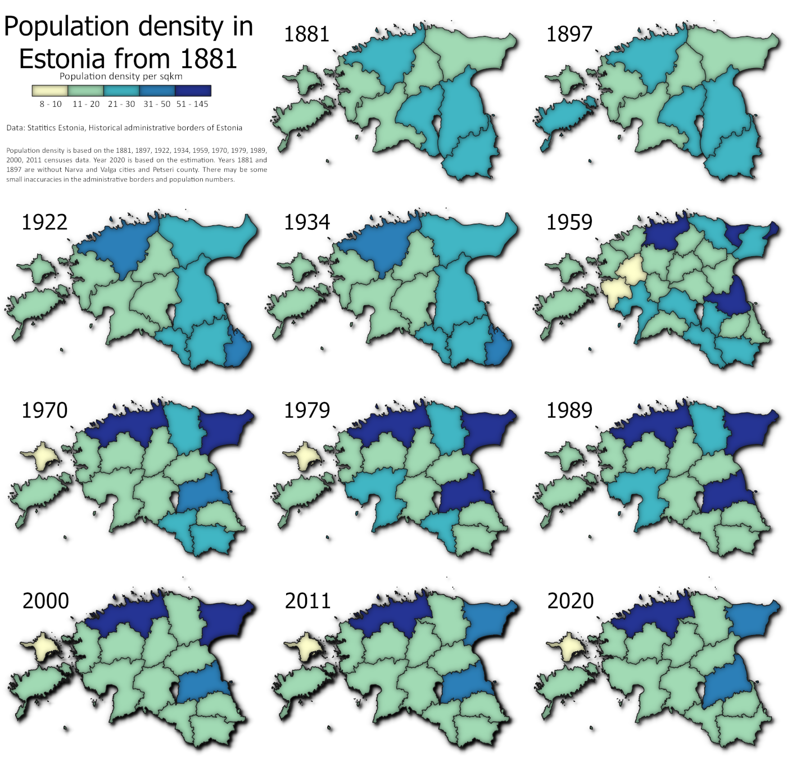

---
layout: article
title: Day 23 - Boundaries - County borders and population through time
modified: 2020-11-23
categories: mapchallenge
image:
  teaser: day23_boundaries_counties_teaser.png
The change of the county level boundaries and population density from 1881 to 2020 in Estonia according to census data. In the original Twitter post, the boundaries of 2000 and 2010 got a bit wrong by accident (too little time in 30daymapchallenge :P) but here they are corrected. This is mapped as small multiples that in some cases is better representation of temporal changes than visualisation as it enables to look at each map separately a bit longer and see the details.

Used tools: QGIS
Data: Statistics Estonia, Historical administrative borders of Estonia

[Link to Twitter post](https://twitter.com/evelynuuemaa/status/1330763637737345026)
