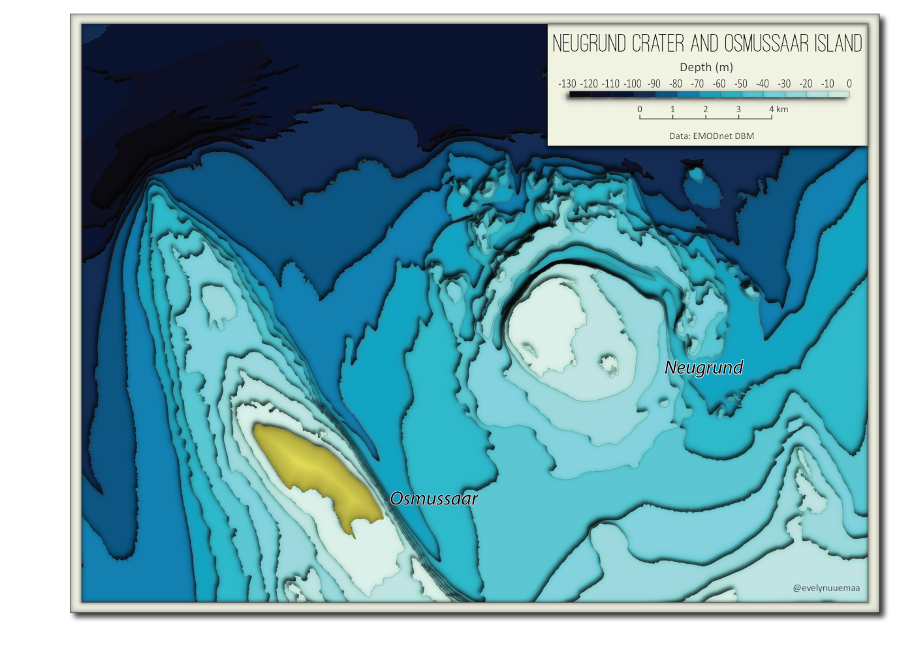

The bathymetry around Osmussaar island and Neugrund meteorite crater. Neugrund is the biggest meteorite crater of Estonia and one of the best–preserved marine impact structures in the world. I used paper-cut style which I really like :)  

Tools: QGIS

Data: [EMODnet DBM](https://www.emodnet-bathymetry.eu/data-products)

[Link to Twitter post](https://twitter.com/evelynuuemaa/status/1331132466694926339)
