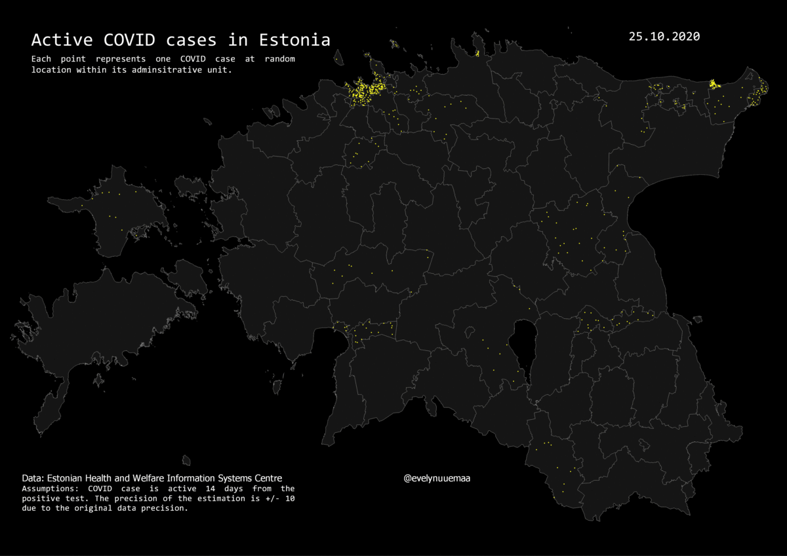

---
layout: article
title: Day 25 - COVID - COVID cases in Estonia
modified: 2020-11-25
categories: mapchallenge
image:
  teaser: day25_covid.gif
Active COVID cases in Estonia mapped as individual random points in the administrative units. I guess this illustrates a bit how likely you are to bump into a COVID in different areas. In rural and remote areas the density of COVID-cases is pretty low whereas in the cities it is high.

Used tools: QGIS
Data: Estonian Health and Welfare Information Systems

[Link to Twitter post](https://twitter.com/evelynuuemaa/status/1331487094007623685)
