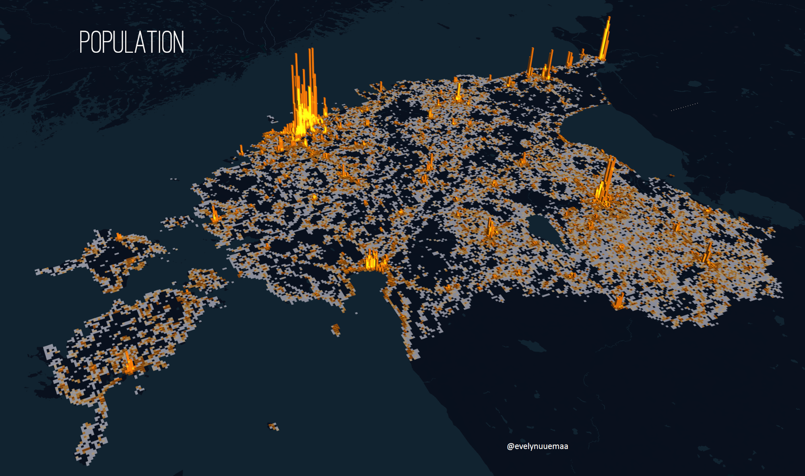

---
layout: article
title: Day 26 - Map with a new tool - Population in 3D
modified: 2020-11-26
categories: mapchallenge
image:
  teaser: 26_new_tool_kepler_teaser.png
Map with a new tool and I made just another population map with [Kepler.gl](http://Kepler.gl). This was more simple than I thought :)

Used tools: Kepler.gl
Data: Statistics Estonia

[Link to Twitter post](https://twitter.com/evelynuuemaa/status/1331874230124875776)
