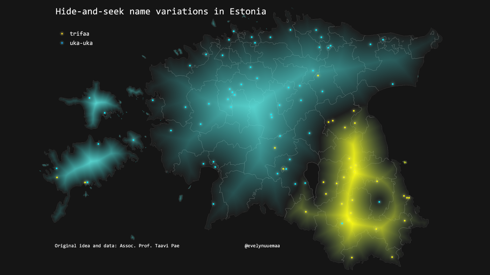

  Hide-and-seek or actually the very correct name in English would be "kick the can" is a game that every Estonian has played in their childhood in long warm summer nights :) The game has several name variations that have kind of clear spatial pattern in Estonia - uka-uka in the north and trifaa in the south. As the borders are not fully clear then I used shapeburst fill to create a bit more fuzzy transition from one to another.  The original idea and data collected by Taavi Pae in FB questionnaire :)

Used tools: QGIS

Data: Taavi Pae

[Link to Twitter post](https://twitter.com/evelynuuemaa/status/1332224459223298048)
