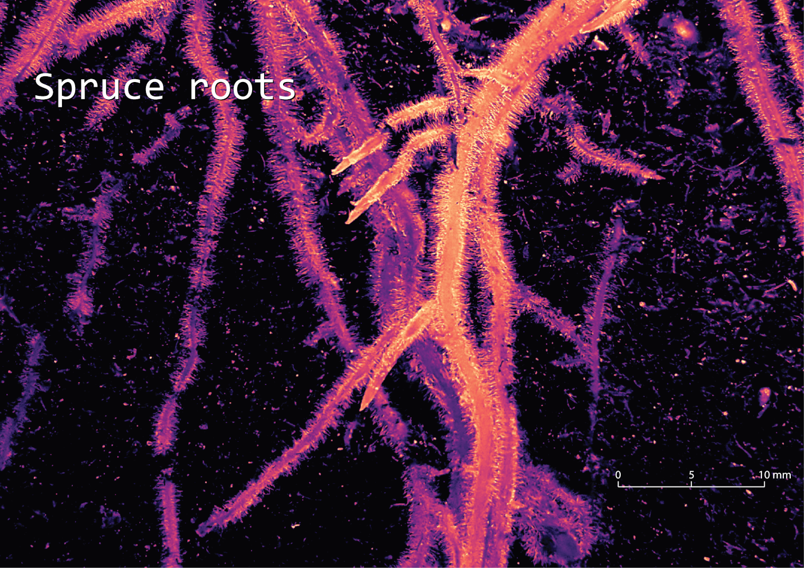

  The hidden life below-ground. Roots are the back-bone of life and biodiversity below-ground. Data collected by an awesome team Ivika Ostonen-Märtin and Marili Sell in the climate manipulation experiment

Tools: QGIS

Data: Ivika Ostonen-Märtin and Marili Sell from Uni Tartu

[Link to Twitter post](https://twitter.com/evelynuuemaa/status/1332603673512390663)
