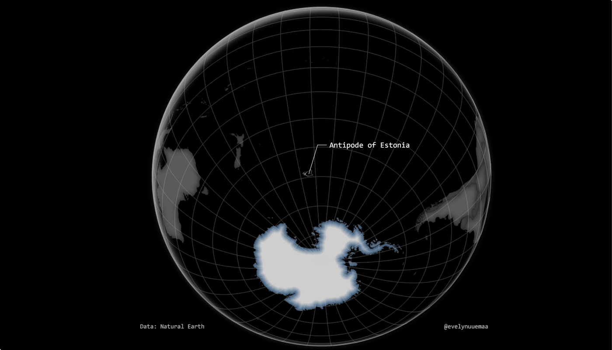

  Everyone knows where Estonia is on the globe but how many of you know that the antipode of Estonia is in the middle of nowhere? Finding a geographic point's antipode is quite simple in GIS, however, to identify the whole country's antipode requires abit more work. Some python magic help was done by Alexander Kmoch in order to to flip the coordinates for Estonia :)

Tools: QGIS, Python

Data: Natural Earth

[Link to Twitter post](https://twitter.com/evelynuuemaa/status/1332947938176339969)
