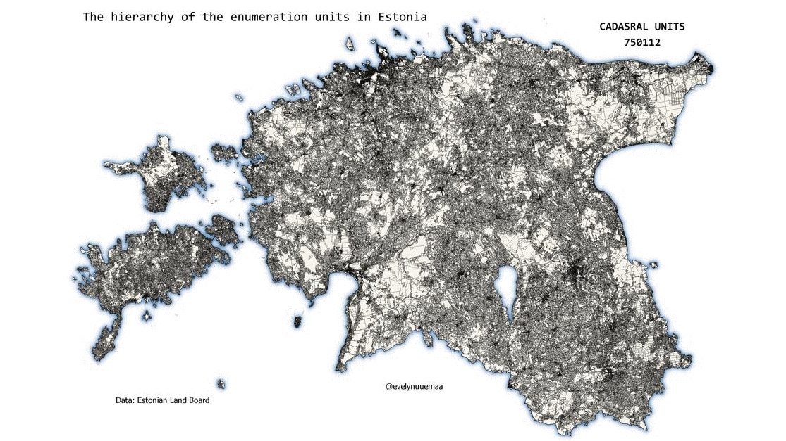

The hierarchy of the enumeration units in #Estonia starting from the smallest: cadastral units (katastruüksused), settlements(külad, linnad, alevid), territorial communities (kandid), municipalities (omavalitsused), counties (maakonand), country. 
An enumeration unit is an area defined for a particular purpose (often other than collecting data) and within which data are collected and aggregated (e.g. administrative units). Enumeration units are most often used for choropleth map.

Data: Estonian Land Board Cadastral units and Administrative units
Tools: QGIS

[Link to Twitter post](https://twitter.com/evelynuuemaa/status/1323547260358135809)
