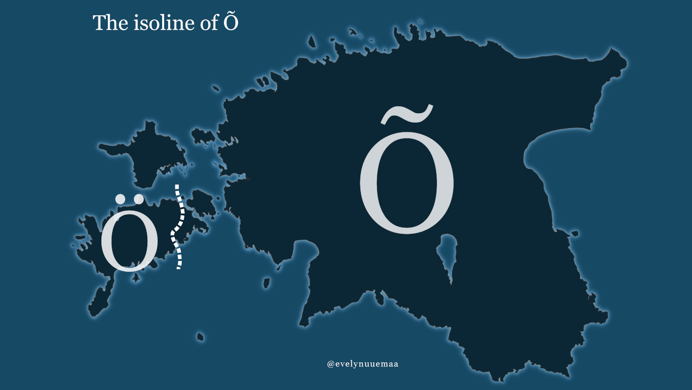

For the map I decided to make a very simple map about the isoline of Õ.  One of the coolest peculiarities in Saaremaa dialect is that instead of Estonian vowel Õ they use Ö. The isoline marks the line where the change in the vowel is found. Historically it was mapped by Theodor Kaljo in 1920ties. The minimalistic light color contrast with dark background works in my opinion very well, so no additional fancy effect are needed :)

Used tools: QGIS

[Link to Twitter post](https://twitter.com/evelynuuemaa/status/1333306990668484609)
