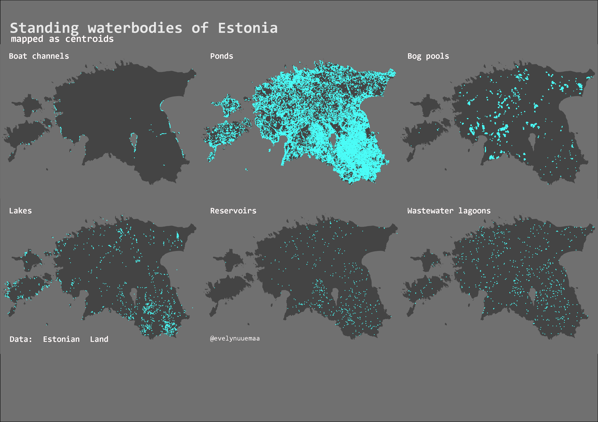

---
layout: article
title: Day 5 - Blue - Standing waterbodies of Estonia
modified: 2020-11-5
categories: mapchallenge
image:
  teaser: day5_blue_lakes_teaser.png

Standing waterbodies of Estonia mapped as centroids. What can I say – every Estonian has to have a pond?

Data: Estonian Land Board, Estonian Topographic Database
Tools: QGIS

[Link to Twitter post](https://twitter.com/evelynuuemaa/status/1324381348950364165)