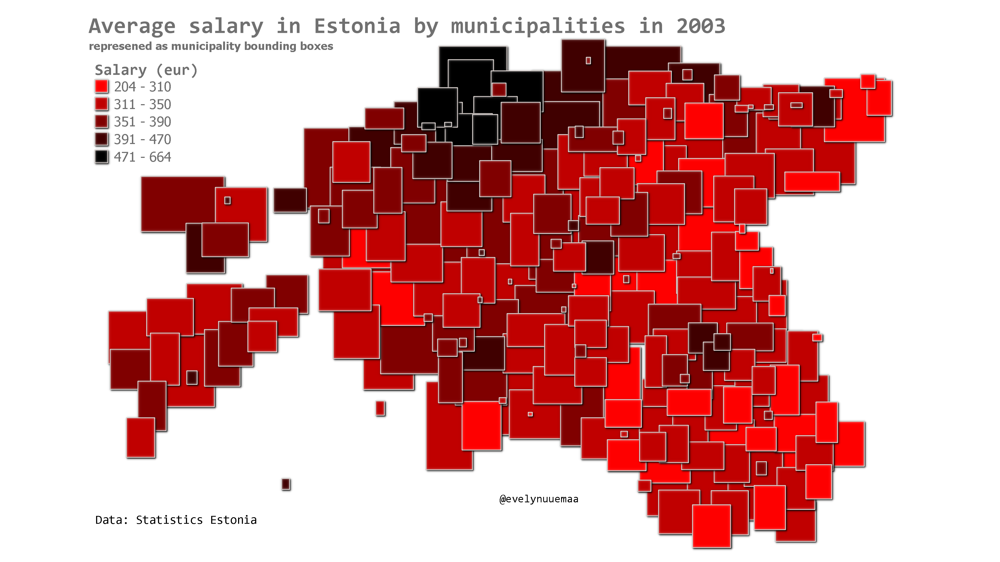

Average salary in Estonia by municipalities in 2003. Who remembers their salary almost 20 years ago? It was sooooo small :O 
The municipalities are represented as bounding boxes (QGIS tool Bounding box) and rendering order based on the municipality area, so that the smaller ones would not get covered by larger ones. 

Data: Statistics Estonia

Tools: QGIS

[Link to Twitter post](https://twitter.com/evelynuuemaa/status/1324636892256763904)
