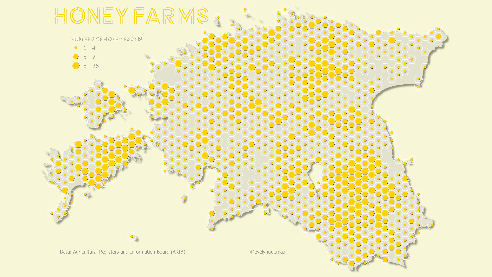

Honey farms in Estonia visualised as a count in the hexagons. 

Methods: The different size of the hexagons was achieved by using a centroid fill and marker symbol for every hexagon and data driven symbology based on the number of the farms. Shadow effect was applied by using the Draw effects. Font [Potra Light](https://www.fontspace.com/potra-light-font-f29815)

Data: [Agricultural Registers and Information Board (ARIB)](https://www.pria.ee/registrid/pria-kaardiandmed)

Tools: QGIS

[Link to Twitter post](https://twitter.com/evelynuuemaa/status/1325365063465754624)
